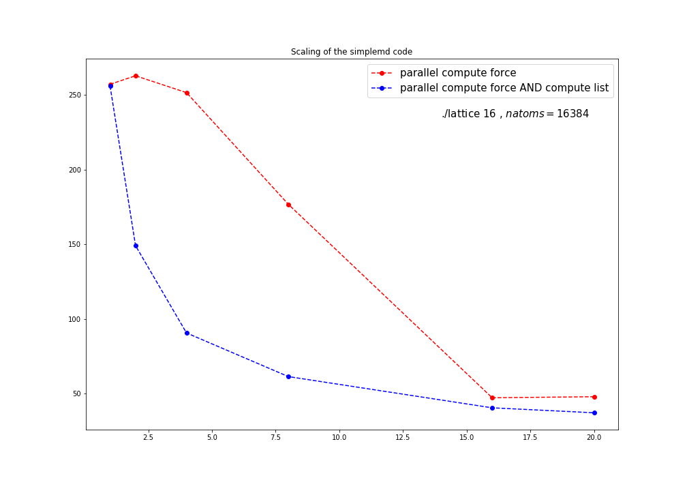

### Day1 Exercise

I apologize for the short report!

Everything can be found in 'src/simplemd.cpp'. The code can be compiled with make and it was runned on Ulysses using 'scaling_script.sh'

Here a plot of the mean energy.

